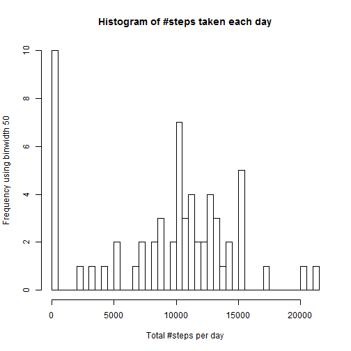
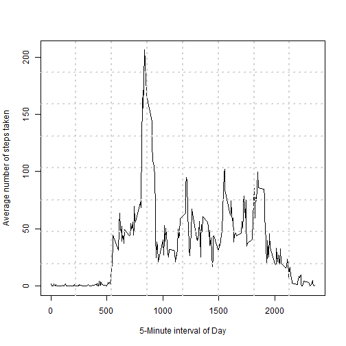
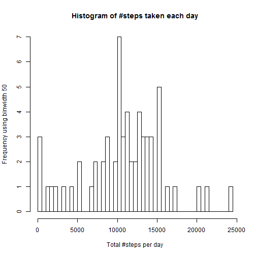
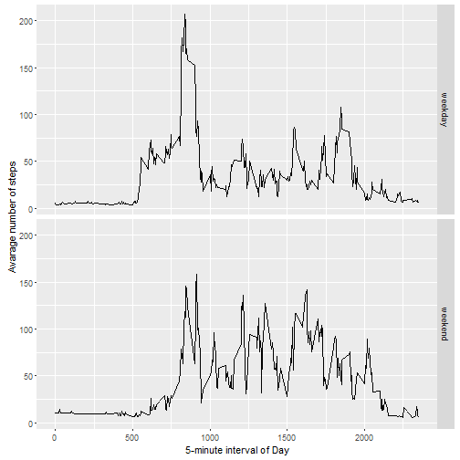

```r
library(ggplot2)
library(chron)                                                  # to be able to use is.weekend(x)
```

### Step #0 : Get the data into a local directory, unzip it.


```r
fileURL   <- "https://d396qusza40orc.cloudfront.net/repdata%2Fdata%2Factivity.zip"

destDir   <- "C:\\Users\\Rahul\\Documents\\Course 05 - Reproducible Research\\"
setwd(destDir)

download.file(fileURL, destfile = "ProgHw1.zip")

if(!file.exists('activity.csv')){
  unzip('ProgHw1.zip')
}
```


### Step #1 : Code for reading in the dataset and/or processing the data.
Loading and preprocessing the data  

Show any code that is needed to  

1. Load the data (i.e. read.csv())  
2. Process/transform the data (if necessary) into a format suitable for your analysis


```r
activityData <- read.csv('activity.csv')
```


### Step #2 : Histogram of the total number of steps taken each day.  
For this part of the assignment, you can ignore the missing values in the dataset.  

1. Calculate the total number of steps taken per day  
2. If you do not understand the difference between a histogram and a barplot, research the difference between them. Make a histogram of the total number of steps taken each day  


```r
dailySteps <- tapply(activityData$steps, activityData$date, sum, na.rm = TRUE)
hist(dailySteps, breaks=50, xlab = 'Total #steps per day', ylab='Frequency using binwidth 50', main = 'Histogram of #steps taken each day')
```

 

```r
# plot(dailySteps, xlab = 'Day of the Observation Window', ylab = 'Total #steps per day')
# qplot(dailySteps, xlab='Total steps per day', ylab='Frequency using binwidth 50', binwidth=50)
```


### Step #3 : Mean and median number of steps taken each day.  
3. Calculate and report the mean and median of the total number of steps taken per day

<span style="color:red">*Note: Since I am unclear whether the question asks to provide the mean and median of the of the totals for the 61 days, or a time series of the mean and median for each of the 61 days, I provide both values below.*</span>


```r
mean(dailySteps)
```

```
## [1] 9354.23
```

```r
median(dailySteps)
```

```
## [1] 10395
```

```r
y1     <- tapply(activityData$steps, activityData$date, mean, na.rm = TRUE)
y1c    <- y1                     # mnemonic : y1c == y1 clean
y1c[is.na(y1)] <- 0              # finds na and NaNs
y1Full <- cbind(y1, y1c)
y1Full
```

```
##                    y1        y1c
## 2012-10-01        NaN  0.0000000
## 2012-10-02  0.4375000  0.4375000
## 2012-10-03 39.4166667 39.4166667
## 2012-10-04 42.0694444 42.0694444
## 2012-10-05 46.1597222 46.1597222
## 2012-10-06 53.5416667 53.5416667
## 2012-10-07 38.2465278 38.2465278
## 2012-10-08        NaN  0.0000000
## 2012-10-09 44.4826389 44.4826389
## 2012-10-10 34.3750000 34.3750000
## 2012-10-11 35.7777778 35.7777778
## 2012-10-12 60.3541667 60.3541667
## 2012-10-13 43.1458333 43.1458333
## 2012-10-14 52.4236111 52.4236111
## 2012-10-15 35.2048611 35.2048611
## 2012-10-16 52.3750000 52.3750000
## 2012-10-17 46.7083333 46.7083333
## 2012-10-18 34.9166667 34.9166667
## 2012-10-19 41.0729167 41.0729167
## 2012-10-20 36.0937500 36.0937500
## 2012-10-21 30.6284722 30.6284722
## 2012-10-22 46.7361111 46.7361111
## 2012-10-23 30.9652778 30.9652778
## 2012-10-24 29.0104167 29.0104167
## 2012-10-25  8.6527778  8.6527778
## 2012-10-26 23.5347222 23.5347222
## 2012-10-27 35.1354167 35.1354167
## 2012-10-28 39.7847222 39.7847222
## 2012-10-29 17.4236111 17.4236111
## 2012-10-30 34.0937500 34.0937500
## 2012-10-31 53.5208333 53.5208333
## 2012-11-01        NaN  0.0000000
## 2012-11-02 36.8055556 36.8055556
## 2012-11-03 36.7048611 36.7048611
## 2012-11-04        NaN  0.0000000
## 2012-11-05 36.2465278 36.2465278
## 2012-11-06 28.9375000 28.9375000
## 2012-11-07 44.7326389 44.7326389
## 2012-11-08 11.1770833 11.1770833
## 2012-11-09        NaN  0.0000000
## 2012-11-10        NaN  0.0000000
## 2012-11-11 43.7777778 43.7777778
## 2012-11-12 37.3784722 37.3784722
## 2012-11-13 25.4722222 25.4722222
## 2012-11-14        NaN  0.0000000
## 2012-11-15  0.1423611  0.1423611
## 2012-11-16 18.8923611 18.8923611
## 2012-11-17 49.7881944 49.7881944
## 2012-11-18 52.4652778 52.4652778
## 2012-11-19 30.6979167 30.6979167
## 2012-11-20 15.5277778 15.5277778
## 2012-11-21 44.3993056 44.3993056
## 2012-11-22 70.9270833 70.9270833
## 2012-11-23 73.5902778 73.5902778
## 2012-11-24 50.2708333 50.2708333
## 2012-11-25 41.0902778 41.0902778
## 2012-11-26 38.7569444 38.7569444
## 2012-11-27 47.3819444 47.3819444
## 2012-11-28 35.3576389 35.3576389
## 2012-11-29 24.4687500 24.4687500
## 2012-11-30        NaN  0.0000000
```

```r
y2     <- tapply(activityData$steps, activityData$date, median, na.rm = TRUE)
y2c    <- y2                     # mnemonic : y2c == y2 clean
y2c[is.na(y2)] <- 0              # finds na and NaNs
y2Full <- cbind(y2, y2c)
y2Full
```

```
##            y2 y2c
## 2012-10-01 NA   0
## 2012-10-02  0   0
## 2012-10-03  0   0
## 2012-10-04  0   0
## 2012-10-05  0   0
## 2012-10-06  0   0
## 2012-10-07  0   0
## 2012-10-08 NA   0
## 2012-10-09  0   0
## 2012-10-10  0   0
## 2012-10-11  0   0
## 2012-10-12  0   0
## 2012-10-13  0   0
## 2012-10-14  0   0
## 2012-10-15  0   0
## 2012-10-16  0   0
## 2012-10-17  0   0
## 2012-10-18  0   0
## 2012-10-19  0   0
## 2012-10-20  0   0
## 2012-10-21  0   0
## 2012-10-22  0   0
## 2012-10-23  0   0
## 2012-10-24  0   0
## 2012-10-25  0   0
## 2012-10-26  0   0
## 2012-10-27  0   0
## 2012-10-28  0   0
## 2012-10-29  0   0
## 2012-10-30  0   0
## 2012-10-31  0   0
## 2012-11-01 NA   0
## 2012-11-02  0   0
## 2012-11-03  0   0
## 2012-11-04 NA   0
## 2012-11-05  0   0
## 2012-11-06  0   0
## 2012-11-07  0   0
## 2012-11-08  0   0
## 2012-11-09 NA   0
## 2012-11-10 NA   0
## 2012-11-11  0   0
## 2012-11-12  0   0
## 2012-11-13  0   0
## 2012-11-14 NA   0
## 2012-11-15  0   0
## 2012-11-16  0   0
## 2012-11-17  0   0
## 2012-11-18  0   0
## 2012-11-19  0   0
## 2012-11-20  0   0
## 2012-11-21  0   0
## 2012-11-22  0   0
## 2012-11-23  0   0
## 2012-11-24  0   0
## 2012-11-25  0   0
## 2012-11-26  0   0
## 2012-11-27  0   0
## 2012-11-28  0   0
## 2012-11-29  0   0
## 2012-11-30 NA   0
```


### Step #4 : Time series plot of the average number of steps taken.

What is the average daily activity pattern?

1. Make a time series plot (i.e. type = "l") of the 5-minute interval (x-axis) and the average number of steps taken, averaged across all days (y-axis)


```r
# y1     <- as.numeric(tapply(activityData$steps, activityData$interval, mean, na.rm = TRUE))
# y1t    <- ts(y1, start = 0, end = 1435, deltat = 5)
# plot.ts(y1t, xlab = '5-Minute interval of Day', ylab = 'Average number of steps taken')

meanStepsPerInterval <- aggregate(x     = list(meanSteps=activityData$steps), 
                                  by    = list(interval=activityData$interval), 
                                  FUN   = mean, 
                                  na.rm = TRUE)

with(meanStepsPerInterval, 
     plot(interval, meanSteps, type = 'l', xlab = '5-Minute interval of Day', ylab = 'Average number of steps taken'))

grid(8, 8, lwd = 2)
```

 

    
### Step #5 : The 5-minute interval that, on average, contains the maximum number of steps.

2. Which 5-minute interval, on average across all the days in the dataset, contains the maximum number of steps?


```r
# meanStepsPerInterval$interval[intervalWithMaxSteps]

intervalWithMaxSteps <- which.max(meanStepsPerInterval$meanSteps)
gsub("([0-9]{1,2})([0-9]{2})", "\\1:\\2", meanStepsPerInterval$interval[intervalWithMaxSteps])
```

```
## [1] "8:35"
```


### Step #6 : Code to describe and show a strategy for imputing missing data.

Note that there are a number of days/intervals where there are missing values (coded as NA). The presence of missing days may introduce bias into some calculations or summaries of the data.

1. Calculate and report the total number of missing values in the dataset (i.e. the total number of rows with NAs)


```r
sum(is.na(activityData$steps))
```

```
## [1] 2304
```

2. Devise a strategy for filling in all of the missing values in the dataset. The strategy does not need to be sophisticated. For example, you could use the mean/median for that day, or the mean for that 5-minute interval, etc.

3. Create a new dataset that is equal to the original dataset but with the missing data filled in.


```r
naValue   <- is.na(activityData$steps)
naIntv    <- activityData$interval[naValue]

# meanStepsPerInterval$interval == naIntv
naIntvDF  <- data.frame(naIntvN = naIntv)                        
msIDF     <- data.frame(idx = seq(1, length(meanStepsPerInterval$interval)), msI = meanStepsPerInterval$interval)
ourIdx    <- merge(naIntvDF, msIDF, by.x = "naIntvN", by.y = "msI") 

fillValue <- meanStepsPerInterval$meanSteps[ourIdx$idx]

activityDataNew <- activityData
activityDataNew$steps[naValue] <- fillValue
```


### Step #7 : Histogram of the total number of steps taken each day after missing values are imputed.

4. Make a histogram of the total number of steps taken each day and Calculate and report the mean and median total number of steps taken per day. Do these values differ from the estimates from the first part of the assignment? What is the impact of imputing missing data on the estimates of the total daily number of steps?


```r
dailyStepsNew <- tapply(activityDataNew$steps, activityDataNew$date, sum, na.rm = TRUE)
hist(dailyStepsNew, breaks=50, xlab = 'Total #steps per day', ylab='Frequency using binwidth 50', main = 'Histogram of #steps taken each day')
```

 

```r
mean(dailyStepsNew)
```

```
## [1] 10766.19
```

```r
median(dailyStepsNew)
```

```
## [1] 11015
```


### Step #8 : Panel plot comparing the average number of steps taken per 5-minute interval across weekdays and weekends.

Are there differences in activity patterns between weekdays and weekends?

For this part the weekdays() function may be of some help here. Use the dataset with the filled-in missing values for this part.

1. Create a new factor variable in the dataset with two levels - "weekday" and "weekend" indicating whether a given date is a weekday or weekend day.

2. Make a panel plot containing a time series plot (i.e. type = "l") of the 5-minute interval (x-axis) and the average number of steps taken, averaged across all weekday days or weekend days (y-axis). See the README file in the GitHub repository to see an example of what this plot should look like using simulated data.


```r
# par(mfrow=c(1,2))
activityDataNew$weekendF <- as.factor(ifelse(is.weekend(activityDataNew$date), 'weekend', 'weekday'))

averagedActivityDataNew <- aggregate(steps ~ interval + weekendF, data = activityDataNew, mean)

ggplot(averagedActivityDataNew, aes(interval, steps)) + 
    geom_line() + 
    facet_grid(weekendF ~ .) +
    xlab("5-minute interval of Day") + 
    ylab("Avarage number of steps")
```

 


### Step #9 : All of the R code needed to reproduce the results (numbers, plots, etc.) in the report.

...is present in this file.
